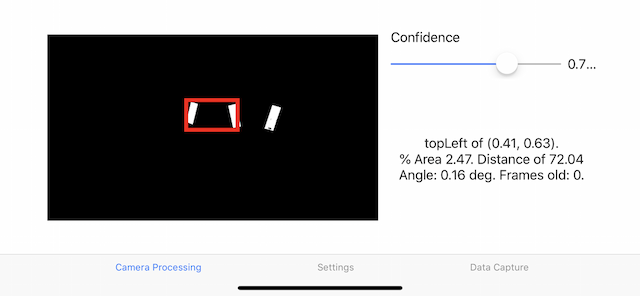
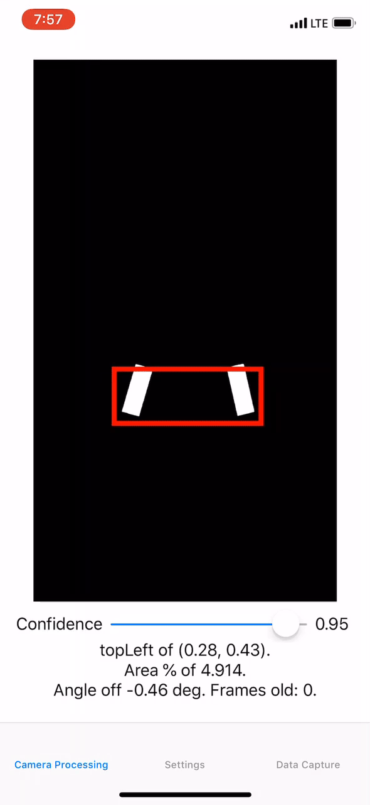

# Robot Vision Tracker - iOS

A **real-time computer vision tracking system** using an iPhone and Apple's Vision SDK. System detects reflective rectangular targets illuminated by LEDs and communicates their position to external devices (e.g. robot) through TCP network sockets and a wired Ethernet connection, bypassing the need for WiFi.

## Features
- ✅ **Real-Time Rectangle Detection** – Uses Apple's Vision framework for detecting field targets.
- ✅ **Custom Filtering Pipeline** – Color filter with CoreImage graphics shader and aspect ratio filters enable precise target identification.
- ✅ **Fast TCP Communication** – Uses IBM BlueSocket API for raw TCP socket JSON data transmission, implementing platform in environments with or without WiFi.  
- ✅ **Precise Angle & Distance Calculation** – Computes target angle relative to the robot's camera.


## Example
Here is a snapshot and demo of the project in action. It successfully identifies the target, and reports on-screen the angle offset, aspect ratio, and location in frame of the detected target. This information is passed onto the external device through the TCP server. Notice in the demo that other shapes, such as the ceiling lights, may pass through the color filter, but are not recognized by the vision model. The video feed is in black and white, where white represents what passes the color filter, and black is everything else.

<table>
  <tr>
    <td valign="top"></td>
    <td></td>
  </tr>
</table>


## Technologies & Skills
- **Swift** User interface, integration of APIs 
- **CoreImage** Color filter shader
- **Vision Framework** Rectangle detection
- **CoreImage** Image processing, user interface front-end development
- **BlueSocket (IBM)** Low-latency TCP socket communication engineered for wired connections

## Setup & Installation

### 1. Clone the Repository 
```bash
git clone https://github.com/technology08/RobotVisionTracker-iOS.git
cd RealTimeRobotVision-iOS
```

### 2. Open in Xcode
- Open `BlueSocketNetworking.xcodeproj`  
- Set your target device to an iPhone running iOS 11+  
- Run the project 

### 3. Connect to the Robot 
- Use an Apple Lightning to USB 3 Camera Adapter  
- Connect a USB to Ethernet Adapter + Ethernet Cable to establish a direct TCP connection

## How It Works

There are two main components to this project: 
- **Vision Processing** – Uses Apple's `VNRectangleDetectionRequest` to detect and track field targets.  
- **TCP Server** – Streams processed vision data (angle & distance) to the robot over **BlueSocket TCP**.

A brief summary: IBM Blue Socket provides the framework for the iPhone to interact with raw TCP Sockets instead of `URLSession`. It can be found here: https://www.github.com/IBM-Swift/BlueSocket.

Apple's built-in Vision framework (iOS 11.0+) provides rectangle detection and tracking algorithms to be used with a green light on the field. Using the field of view and the size of the frame, the goal is to calculate the difference of the target to the center of the frame in degrees.

There are three filters in this project. The first is a  color filter, using a `CIColorKernel`. A minimum and maximum RGB value is specified, and CoreImage filters the image as black and white. The second filter will be an aspect ratio. The third filter will look at the negative space between the two detected rectangles to ensure they are not tiny points.


## 📷 Vision Processing (`Rectangle.swift`)

- **Step 1:** Applies color filter (`CIColorKernel`) to isolate green light from the image field.  
- **Step 2:** Uses [`VNRectangleDetectionRequest`](https://developer.apple.com/documentation/vision/vndetectrectanglesrequest) to find up to 6 potential targets.  
- **Step 3:** Filters results by aspect ratio & negative space detection.  
- **Step 4:** Calculates the target angle & distance from image frame data.  
- **Step 5:** Updates data to be sent along TCP Server for real-time robot tracking.
  
(`CoreML.swift` is a deprecated research avenue using a custom-trained YOLO Turi Create neural network, not as performant). 

The current vision targets for the consist of two rectangles slanted in towards each other. The platform removes objects below a height threshold. It then sorts the observations left to right into `leftResults` and `rightResults`. It selects the first left rectangle and the very next right rectangle and computes an equation to ensure that lines drawn from the corners would intersect below the topLeft point (hence the fitting func name of `isIntersectionAbove`). 

Once these two rectangles are found, they are tracked *independently* with two separate trackers. However, the `groupResults(target1:, target2:)` calculates the degrees from the center and distance based on area % regression.

## ✴️ Data Structure

The file `VisionData.swift` contains the data structure for both parsing the observations from Vision and sending the observations over BlueSocket. It can be sent either as a JSON, conforming to the `Codable` protocol, or a pipe-separated string. 

#### Sent Data Format (Pipe-Separated) 
`getPipeString()` method is default data structure: `|` separates the different values, and `^` is the key-value separator, as `:` was used in the timestamp.
```
timestamp|angle^15.2|distance^4.3  
```
- `|` separates different values  
- `^` separates keys and values (since `:` is used in timestamps)  

## 📡 TCP Server (`Socket.swift`)

- The server listens for requests from the robot.  
- When `"VISION"` is received, it returns the latest detected angle & distance data.  
- Uses thread-locking to prevent race conditions in shared vision data.

Functions of note:
- `runServer(port:)` creates and runs the server, enabling the iPhone to receive vision requests from external device/robot
- `getVisionData()` is the **data consumer** called when the code string `"VISION"` is sent by the socket client, fetches and returns latest vision data with thread-locking for concurrency, writes to client (private method)
- `setVisionData(data:)` is the **data producer**, updates the vision data to be sent with thread-locking for concurrency
  
To shutdown the server at any time, send the string `"SHUTDOWN"`. Please be advised that you will have to currently **restart the app** to restart the server.

## Project Checklist

- ✅ TCP Socket Initialized
- ✅ TCP Socket communicates random JSON data to robot 
- ✅ Camera is set up
- ✅ Color filter
- [ ] Negative space filter
- ✅ Rectangle detection
- ✅ Rectangle tracking
- ✅ Calculating angle from data
- ✅ Calculating height from data
- ✅ Sending correct data over in a JSON format to robot


## 🔗 References & Related Work  
- [IBM BlueSocket](https://www.github.com/IBM-Swift/BlueSocket)  
- [Apple Vision Framework](https://developer.apple.com/documentation/vision/vndetectrectanglesrequest)  


## 📌 Contributors  
👨‍💻 **Connor Espenshade** – Lead Developer ([LinkedIn](https://linkedin.com/in/cespenshade))  

